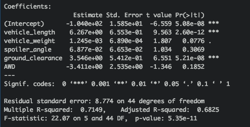
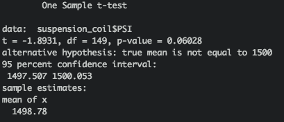
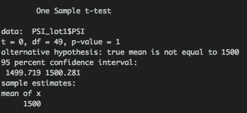
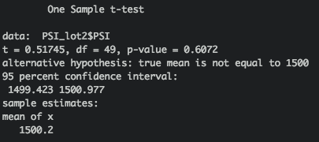
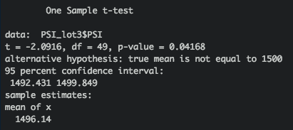

# MechaCar_Statistical_Analysis

## Linear Regression to Predict MPG

- Based on the linear regression model and significance level of 5%, the vehicle length and ground clearance have a significant impact on the mpg of the vehicle. 
- Also, the r-squared value is 0.715 meaning roughly 72% of all the mpg predictions will be correct when using this model
- The p-value is of our linear regression analysis is much smaller than our significance level, so there is sufficient evidence to reject our null hypothesis meaning the slope of the linear model is not zero

## Summary Statistics on Suspension Coils

- Based on the total summary dataframe, it can be seen that the overall variance of the suspension coils is 62.29 which is within the design specification of 100 PSI and as such meets the design criteria

- Based on the summary by lots, it can be seen that for Lots 1 and 2, the variance is well within the design specification of 100 PSI. However, for Lot 3, the variance is 170.29 which exceeds the permissable design specification for suspension coils

## T-Tests on Suspension Coils

- Based on the t-test for all lots, assuming a significance level of 0.05, our p-value of 0.06 is above the significance level indicating we don't have sufficient evidence to reject our null hypothesis and so the mean is statistically similar to the population mean of 1500 PSI

- Based on the t-test for Lot 1, assuming a significance level of 0.05, our p-value of 1 is above the significance level indicating we don't have sufficient evidence to reject our null hypothesis and so the mean is statistically similar to the population mean of 1500 PSI

- Based on the t-test for Lot 2, assuming a significance level of 0.05, our p-value of 0.6 is above the significance level indicating we don't have sufficient evidence to reject our null hypothesis and so the mean is statistically similar to the population mean of 1500 PSI

- Based on the t-test for Lot 2, assuming a significance level of 0.05, our p-value of 0.04 is below the significance level indicating we have sufficient evidence to reject our null hypothesis and so the mean is statistically different to the population mean of 1500 PSI

 
